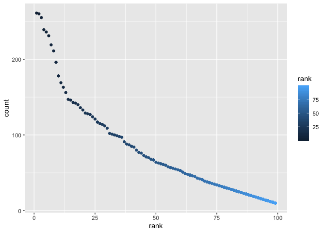

p8105\_hw2\_jz3183
================
Jungang Zou
9/25/2019

# Homework 2 for Data Science Course p8105

This is an R Markdown document for homework 2 in course p8105. The
author is Jungang Zou whose UNI is jz3183.

## Problem 1

In the first problem, I need to clean the Mr.Trash Wheel sheet at first.
In the following chunk, I need to read the excel file and do some data
cleaning.

``` r
# read the data frame from excel file on sheet named "Mr. Trash Wheel"
df_trash_wheel = 
  #read data from excel file
  read_excel('./HealthyHarborWaterWheelTotals2018-7-28.xlsx', sheet = "Mr. Trash Wheel", skip = 1) %>% 
  
  #delete the last columns containing notes
  select(-...15) %>% 
  
  #clean columns` names
  janitor::clean_names() %>% 
  
  #delete the rows that do not include dumpster-specific data
  drop_na(dumpster) %>% 
  
  #round the number of sports balls to the nearest integer and converts the result to an integer variable
  mutate(sports_balls = as.integer(round(sports_balls, 0)))
## New names:
## * `` -> ...15
  
# display the data frame
df_trash_wheel
## # A tibble: 285 x 14
##   dumpster month  year date                weight_tons volume_cubic_ya…
##      <dbl> <chr> <dbl> <dttm>                    <dbl>            <dbl>
## 1        1 May    2014 2014-05-16 00:00:00        4.31               18
## 2        2 May    2014 2014-05-16 00:00:00        2.74               13
## 3        3 May    2014 2014-05-16 00:00:00        3.45               15
## # … with 282 more rows, and 8 more variables: plastic_bottles <dbl>,
## #   polystyrene <dbl>, cigarette_butts <dbl>, glass_bottles <dbl>,
## #   grocery_bags <dbl>, chip_bags <dbl>, sports_balls <int>,
## #   homes_powered <dbl>
```

After I have read the sheet named “Mr. Trash Wheel”, I need to read and
clean precipitation data for 2017 and 2018. In the following chunk, I
need to read data from different the excel sheets and do some data
cleaning.

``` r
# read the data frame from excel file on sheet named "2017 Precipitation" and "2018 Precipitation".

df_precipitation_2017 = 
  #read the data on on sheet named "2017 Precipitation" from excel file
  read_excel('./HealthyHarborWaterWheelTotals2018-7-28.xlsx', sheet = "2017 Precipitation", skip = 1) %>% 
  #clean columns` names
  janitor::clean_names() %>% 
  
  #clean up the rows with  Na.
  drop_na() %>% 
  
  #add the year variable
  mutate(year = "2017")


df_precipitation_2018 = 
  #read the data on on sheet named "2018 Precipitation" from excel file
  read_excel('./HealthyHarborWaterWheelTotals2018-7-28.xlsx', sheet = "2018 Precipitation", skip = 1) %>% 
  #clean columns` names
  janitor::clean_names() %>% 
  
  #clean up the rows with  Na.
  drop_na() %>% 
  
  #add the year variable
  mutate(year = "2018")

#combine precipitation datasets and convert month to a character variable

df_precipitation = 
  #combine 2 datasets by binding the rows.
  bind_rows(df_precipitation_2017, df_precipitation_2018) %>% 
  
  #convert month to a character variable by using month.name
  mutate(month = month.name[month])

# display the data frame
df_precipitation
## # A tibble: 19 x 3
##    month     total year 
##    <chr>     <dbl> <chr>
##  1 January    2.34 2017 
##  2 February   1.46 2017 
##  3 March      3.57 2017 
##  4 April      3.99 2017 
##  5 May        5.64 2017 
##  6 June       1.4  2017 
##  7 July       7.09 2017 
##  8 August     4.44 2017 
##  9 September  1.95 2017 
## 10 October    0    2017 
## 11 November   0.11 2017 
## 12 December   0.94 2017 
## 13 January    0.96 2018 
## 14 February   5.3  2018 
## 15 March      2.18 2018 
## 16 April      3.2  2018 
## 17 May        9.27 2018 
## 18 June       0.2  2018 
## 19 July       2.39 2018
```

Finally, I need to write a paragraph about the data. As we know, there
are totally 2 resulting dataframes named “df\_trash\_wheel” and
“df\_precipitation”. For the dataframe named “df\_trash\_wheel”, there
are totally 285 observations and 14 variables. To show the key
variables, we will first show the names of variables: dumpster, month,
year, date, weight\_tons, volume\_cubic\_yards, plastic\_bottles,
polystyrene, cigarette\_butts, glass\_bottles, grocery\_bags,
chip\_bags, sports\_balls, homes\_powered

## Problem 2

``` r
# read the data frame from excel file on sheet named "Mr. Trash Wheel"
df_pols_month = 
  read_csv('./fivethirtyeight_datasets/pols-month.csv') %>% 
  janitor::clean_names() %>% 
  separate(mon, into = c("year", "month", "day"), sep = "-") %>% 
  mutate(month = month.name[as.integer(month)]) %>% 
  pivot_longer(
    c(prez_gop, prez_dem),
    names_to = "president", 
    values_to = "president_value",
    names_prefix = "prez_"
  ) %>% 
  filter(president_value != 0) %>% 
  select(-president_value, -day)
## Parsed with column specification:
## cols(
##   mon = col_date(format = ""),
##   prez_gop = col_double(),
##   gov_gop = col_double(),
##   sen_gop = col_double(),
##   rep_gop = col_double(),
##   prez_dem = col_double(),
##   gov_dem = col_double(),
##   sen_dem = col_double(),
##   rep_dem = col_double()
## )
  
#view(df_pols_month)

df_snp = 
  read_csv('./fivethirtyeight_datasets/snp.csv') %>% 
  janitor::clean_names() %>% 
  separate(date, into = c("month", "day", "year"), sep = "/") %>% 
  arrange(year, month) %>% 
  mutate(month = month.name[as.integer(month)]) %>% 
  select(year, month, everything(), -day)
## Parsed with column specification:
## cols(
##   date = col_character(),
##   close = col_double()
## )


df_unemployment = 
  read_csv('./fivethirtyeight_datasets/unemployment.csv') %>% 
  janitor::clean_names() %>% 
  mutate(year = as.character(year)) %>% 
  pivot_longer(
    jan:dec,
    names_to = "month", 
    values_to = "month_value"
  ) %>% 
  mutate(month = str_subset(month.name, str_to_sentence(month)))
## Parsed with column specification:
## cols(
##   Year = col_double(),
##   Jan = col_double(),
##   Feb = col_double(),
##   Mar = col_double(),
##   Apr = col_double(),
##   May = col_double(),
##   Jun = col_double(),
##   Jul = col_double(),
##   Aug = col_double(),
##   Sep = col_double(),
##   Oct = col_double(),
##   Nov = col_double(),
##   Dec = col_double()
## )
  
  
# display the data frame
df_pols_month
## # A tibble: 822 x 9
##   year  month    gov_gop sen_gop rep_gop gov_dem sen_dem rep_dem president
##   <chr> <chr>      <dbl>   <dbl>   <dbl>   <dbl>   <dbl>   <dbl> <chr>    
## 1 1947  January       23      51     253      23      45     198 dem      
## 2 1947  February      23      51     253      23      45     198 dem      
## 3 1947  March         23      51     253      23      45     198 dem      
## # … with 819 more rows
df_unemployment 
## # A tibble: 816 x 3
##   year  month    month_value
##   <chr> <chr>          <dbl>
## 1 1948  January          3.4
## 2 1948  February         3.8
## 3 1948  March            4  
## # … with 813 more rows
df_snp
## # A tibble: 787 x 3
##   year  month    close
##   <chr> <chr>    <dbl>
## 1 1950  January   17.0
## 2 1950  October   19.5
## 3 1950  November  19.5
## # … with 784 more rows
```

``` r
# read the data frame from excel file on sheet named "Mr. Tra"

df_merge = 
  left_join(df_pols_month, df_snp, by = c("year", "month")) %>% 
  left_join(., df_unemployment, by = c("year", "month"))

df_merge
## # A tibble: 822 x 11
##   year  month gov_gop sen_gop rep_gop gov_dem sen_dem rep_dem president
##   <chr> <chr>   <dbl>   <dbl>   <dbl>   <dbl>   <dbl>   <dbl> <chr>    
## 1 1947  Janu…      23      51     253      23      45     198 dem      
## 2 1947  Febr…      23      51     253      23      45     198 dem      
## 3 1947  March      23      51     253      23      45     198 dem      
## # … with 819 more rows, and 2 more variables: close <dbl>,
## #   month_value <dbl>
```

## Problem 3

``` r
# read the data frame from excel file on sheet named "Mr. Trash Wheel"
df_popular_baby_names = 
  read_csv('./Popular_Baby_Names.csv') %>% 
  janitor::clean_names() %>% 
  mutate_all(~replace(., ethnicity == "ASIAN AND PACI", "ASIAN AND PACIFIC ISLANDER")) %>% 
  mutate_all(~replace(., ethnicity == "BLACK NON HISP", "BLACK NON HISPANIC")) %>% 
  mutate_all(~replace(., ethnicity == "WHITE NON HISP", "WHITE NON HISPANIC")) %>% 
  distinct()
## Parsed with column specification:
## cols(
##   `Year of Birth` = col_double(),
##   Gender = col_character(),
##   Ethnicity = col_character(),
##   `Child's First Name` = col_character(),
##   Count = col_double(),
##   Rank = col_double()
## )

df_popular_baby_names
## # A tibble: 12,181 x 6
##   year_of_birth gender ethnicity               childs_first_na… count rank 
##   <chr>         <chr>  <chr>                   <chr>            <chr> <chr>
## 1 2016          FEMALE ASIAN AND PACIFIC ISLA… Olivia           172   1    
## 2 2016          FEMALE ASIAN AND PACIFIC ISLA… Chloe            112   2    
## 3 2016          FEMALE ASIAN AND PACIFIC ISLA… Sophia           104   3    
## # … with 1.218e+04 more rows


olivia_data = 
  filter(df_popular_baby_names, childs_first_name == "Olivia") %>% 
  pivot_wider(
    id_cols = ethnicity,
    names_from = year_of_birth, 
    values_from = rank
  )
  #mutate_all(~replace(., is.na(.), 0)) %>% 
  
  


olivia_data
## # A tibble: 4 x 5
##   ethnicity                  `2016` `2015` `2014` `2013`
##   <chr>                      <chr>  <chr>  <chr>  <chr> 
## 1 ASIAN AND PACIFIC ISLANDER 1      1      1      3     
## 2 BLACK NON HISPANIC         8      4      8      6     
## 3 HISPANIC                   13     16     16     22    
## 4 WHITE NON HISPANIC         1      1      1      1


popular_male_name = 
  filter(df_popular_baby_names, rank == 1, gender == "MALE") %>% 
  pivot_wider(
    id_cols = ethnicity,
    names_from = year_of_birth, 
    values_from = childs_first_name
  ) 

popular_male_name
## # A tibble: 4 x 7
##   ethnicity                  `2016` `2015` `2014` `2013` `2012` `2011` 
##   <chr>                      <chr>  <chr>  <chr>  <chr>  <chr>  <chr>  
## 1 ASIAN AND PACIFIC ISLANDER Ethan  Jayden Jayden Jayden <NA>   ETHAN  
## 2 BLACK NON HISPANIC         Noah   Noah   Ethan  Ethan  <NA>   JAYDEN 
## 3 HISPANIC                   Liam   Liam   Liam   Jayden JAYDEN JAYDEN 
## 4 WHITE NON HISPANIC         Joseph David  Joseph David  <NA>   MICHAEL

plot_data = 
  mutate(df_popular_baby_names, count = as.integer(count), rank = as.integer(rank)) %>% 
  filter(year_of_birth == 2016, ethnicity == "WHITE NON HISPANIC", gender == "MALE") %>% 
  select(count, rank, childs_first_name) 

plot_data
## # A tibble: 364 x 3
##   count  rank childs_first_name
##   <int> <int> <chr>            
## 1   261     1 Joseph           
## 2   260     2 Michael          
## 3   255     3 David            
## # … with 361 more rows

ggplot(plot_data) + geom_point(aes(x = rank, y = count, color = rank))
```

<!-- -->
