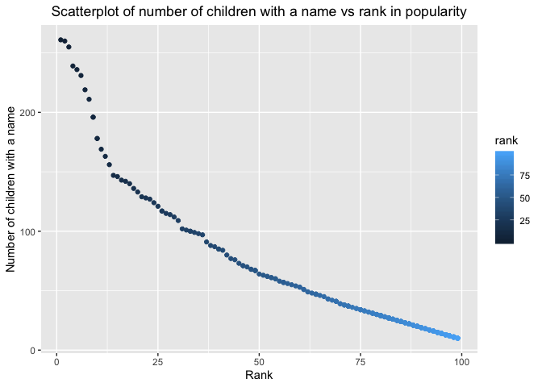

p8105\_hw2\_jz3183
================
Jungang Zou
9/25/2019

# Homework 2 for Data Science Course p8105

This is an R Markdown document for homework 2 in course p8105. The
author is Jungang Zou whose UNI is jz3183.

## Problem 1

In the first problem, I need to clean the Mr.Trash Wheel sheet at first.
In the following chunk, I need to read the excel file and do some data
cleaning.

``` r
# read the data frame from excel file on sheet named "Mr. Trash Wheel"
df_trash_wheel = 
  #read data from excel file
  read_excel('./Trash-Wheel-Collection-Totals-8-6-19.xlsx', sheet = "Mr. Trash Wheel", skip = 1) %>% 
  
  #delete the last columns containing notes
  select(-...15, -...16, -...17) %>% 
  
  #clean columns` names
  janitor::clean_names() %>% 
  
  #delete the rows that do not include dumpster-specific data
  drop_na(dumpster) %>% 
  
  #round the number of sports balls to the nearest integer and converts the result to an integer variable
  mutate(sports_balls = as.integer(round(sports_balls, 0)))
  
# display the data frame
df_trash_wheel
## # A tibble: 344 x 14
##   dumpster month  year date                weight_tons volume_cubic_ya…
##      <dbl> <chr> <dbl> <dttm>                    <dbl>            <dbl>
## 1        1 May    2014 2014-05-16 00:00:00        4.31               18
## 2        2 May    2014 2014-05-16 00:00:00        2.74               13
## 3        3 May    2014 2014-05-16 00:00:00        3.45               15
## # … with 341 more rows, and 8 more variables: plastic_bottles <dbl>,
## #   polystyrene <dbl>, cigarette_butts <dbl>, glass_bottles <dbl>,
## #   grocery_bags <dbl>, chip_bags <dbl>, sports_balls <int>,
## #   homes_powered <dbl>
```

After I have read the sheet named “Mr. Trash Wheel”, I need to read and
clean precipitation data for 2017 and 2018. In the following chunk, I
need to read data from different the excel sheets and do some data
cleaning.

``` r
# read the data frame from excel file on sheet named "2017 Precipitation" and "2018 Precipitation".

df_precipitation_2017 = 
  #read the data on on sheet named "2017 Precipitation" from excel file
  read_excel('./Trash-Wheel-Collection-Totals-8-6-19.xlsx', sheet = "2017 Precipitation", skip = 1) %>% 
  
  #clean columns` names
  janitor::clean_names() %>% 
  
  #clean up the rows with  Na.
  drop_na() %>% 
  
  #add the year variable
  mutate(year = "2017")


df_precipitation_2018 = 
  #read the data on on sheet named "2018 Precipitation" from excel file
  read_excel('./Trash-Wheel-Collection-Totals-8-6-19.xlsx', sheet = "2018 Precipitation", skip = 1) %>% 
  
  #clean columns` names
  janitor::clean_names() %>% 
  
  #clean up the rows with  Na.
  drop_na() %>% 
  
  #add the year variable
  mutate(year = "2018")

#combine precipitation datasets and convert month to a character variable

df_precipitation = 
  #combine 2 datasets by binding the rows.
  bind_rows(df_precipitation_2017, df_precipitation_2018) %>% 
  
  #convert month to a character variable by using month.name
  mutate(month = month.name[month])

# display the data frame
df_precipitation
## # A tibble: 24 x 3
##   month    total year 
##   <chr>    <dbl> <chr>
## 1 January   2.34 2017 
## 2 February  1.46 2017 
## 3 March     3.57 2017 
## # … with 21 more rows
```

Finally, I need to write a paragraph about the data. As we know, there
are totally 2 resulting dataframes named “df\_trash\_wheel” and
“df\_precipitation”.

For the dataframe named “df\_trash\_wheel”, there are totally 344
observations and 14 variables. To show the key variables, we will first
show the names of key variables: dumpster, month, year, date,
weight\_tons, volume\_cubic\_yards. The first variable dumpster is a key
for each observation. The 3 variables month, year, date show the time of
each observation, and the 2 variables weight\_tons, volume\_cubic\_yards
which indicate the amount of trash in each observation.

For the dataframe named “df\_precipitation”, there are totally 24
observations and 3 variables. To show the key variables, we will first
show the names of key variables: month, total, year. The first variable
month, year is the date for each observation. The variables total show
the precipitation of each observation.

In addition, for 2 dataframes “df\_precipitation\_2017” and
“df\_precipitation\_2018”, there are totally 12 observations and 3
variables in “df\_precipitation\_2017”, and 12 observations and 3
variables in “df\_precipitation\_2018”. To show the key variables, we
will first show the names of key variables: month, total, year. The
first variable month, year is the date for each observation. The
variables total show the precipitation of each observation.

In 2018, the total precipitation is 70.33. In 2017, the median number of
sports balls in a dumpster is 8.

## Problem 2

In the second problem, I need to clean the 3 dataset. In the following
chunk, I will read three excel files in a folder and do some data
cleaning.

``` r
# read the data frame from excel file in folder named "fivethirtyeight_datasets".
df_pols_month = 
  #read data
  read_csv('./fivethirtyeight_datasets/pols-month.csv') %>% 
  
  #clean names
  janitor::clean_names() %>% 
  
  #separate variable "mon" into 3 columns
  separate(mon, into = c("year", "month", "day"), sep = "-") %>% 
  
  #change month into the character of month.name
  mutate(month = month.name[as.integer(month)]) %>% 
  
  #set variable "president"
  pivot_longer(
    c(prez_gop, prez_dem),
    names_to = "president", 
    values_to = "president_value",
    names_prefix = "prez_"
  ) %>% 
  
  #delete the row whose value which is 0
  filter(president_value != 0) %>% 
  
  #delete 2 columns
  select(-president_value, -day)
  


df_snp = 
  #read data
  read_csv('./fivethirtyeight_datasets/snp.csv') %>% 
  
  #clean names
  janitor::clean_names() %>% 
  
  #separate variable "date" into 3 columns
  separate(date, into = c("month", "day", "year"), sep = "/") %>% 
  
  #sort date
  arrange(year, month) %>% 
  
  #change month into the character of month.name
  mutate(month = month.name[as.integer(month)]) %>%
  
  #set variable "year", "month" at first and delete variable "day"
  select(year, month, everything(), -day)


df_unemployment = 
  #read data
  read_csv('./fivethirtyeight_datasets/unemployment.csv') %>% 
  
  #clean names
  janitor::clean_names() %>% 
  
  #change variable "year" as character
  mutate(year = as.character(year)) %>% 
  
  #spread month data to month columns
  pivot_longer(
    jan:dec,
    names_to = "month", 
    values_to = "percentage_of_unemployment"
  ) %>% 
  
  #change the "month" variable to month.name with first capital letter.
  mutate(month = str_subset(month.name, str_to_sentence(month)))

  
# display the data frame
df_pols_month
## # A tibble: 822 x 9
##   year  month    gov_gop sen_gop rep_gop gov_dem sen_dem rep_dem president
##   <chr> <chr>      <dbl>   <dbl>   <dbl>   <dbl>   <dbl>   <dbl> <chr>    
## 1 1947  January       23      51     253      23      45     198 dem      
## 2 1947  February      23      51     253      23      45     198 dem      
## 3 1947  March         23      51     253      23      45     198 dem      
## # … with 819 more rows


df_snp
## # A tibble: 787 x 3
##   year  month    close
##   <chr> <chr>    <dbl>
## 1 1950  January   17.0
## 2 1950  October   19.5
## 3 1950  November  19.5
## # … with 784 more rows


df_unemployment 
## # A tibble: 816 x 3
##   year  month    percentage_of_unemployment
##   <chr> <chr>                         <dbl>
## 1 1948  January                         3.4
## 2 1948  February                        3.8
## 3 1948  March                           4  
## # … with 813 more rows
```

After data cleaning, I will merge the 3 different dataframe into
one.

``` r
# Join the datasets by merging df_snp into df_pols_month, and merging df_unemployment into the result.
df_merge = 
  left_join(df_pols_month, df_snp, by = c("year", "month")) %>% 
  left_join(., df_unemployment, by = c("year", "month"))


#display the dataframe
df_merge
## # A tibble: 822 x 11
##   year  month gov_gop sen_gop rep_gop gov_dem sen_dem rep_dem president
##   <chr> <chr>   <dbl>   <dbl>   <dbl>   <dbl>   <dbl>   <dbl> <chr>    
## 1 1947  Janu…      23      51     253      23      45     198 dem      
## 2 1947  Febr…      23      51     253      23      45     198 dem      
## 3 1947  March      23      51     253      23      45     198 dem      
## # … with 819 more rows, and 2 more variables: close <dbl>,
## #   percentage_of_unemployment <dbl>
```

Finally, I will write a short paragraph to explain 4 datasets above
briefly.

Dataset “df\_pols\_month” contains the data about national politicians
who are democratic or republican at any given time. The resulting
dataset contains totally 822 observations and 9 variables:

  - year, month: 2 key variables, the date of count, range from January,
    1947 to June, 2015.
  - gov\_gop: the number of republican governors on the associated date.
  - sen\_gop: the number of republican senators on the associated date.
  - rep\_gop: the number of republican representatives on the associated
    date.
  - gov\_dem: the number of democratic governors on the associated date.
  - sen\_dem: the number of democratic senators on the associated date.
  - rep\_dem: the number of democratic representatives on the associated
    date.
  - president: key variable, indicate whether the president was
    republican or democratic governors.

Dataset “df\_snp” contains the data about Standard & Poor’s stock market
index (S\&P), which is a representative measure of stock market as a
whole. The resulting dataset contains totally 787 observations and 3
variables:

  - year, month: 2 key variables, the date of count, range from January,
    1950 to July, 2015.
  - close: key variable, the closing values of the S\&P stock index on
    the associated date.

Dataset “df\_unemployment” contains the data about percentage of
unemployment and date. The resulting dataset contains totally 816
observations and 3 variables:

  - year, month: 2 key variables, the date of count, range from January,
    1948 to December, 2015.
  - percentage\_of\_unemployment: key variable, percentage of
    unemployment on the associated date.

Dataset “df\_merge” contains the data about S\&P, percentage of
unemployment and information about national politicians. The resulting
dataset contains totally 822 observations and 11 variables:

  - year, month: 2 key variables, the date of count, range from January,
    1947 to June, 2015.
  - close: key variable, the closing values of the S\&P stock index on
    the associated date.
  - percentage\_of\_unemployment: key variable, percentage of
    unemployment on the associated date.
  - president: key variable, indicate whether the president was
    republican or democratic governors.
  - gov\_gop: the number of republican governors on the associated date.
  - sen\_gop: the number of republican senators on the associated date.
  - rep\_gop: the number of republican representatives on the associated
    date.
  - gov\_dem: the number of democratic governors on the associated date.
  - sen\_dem: the number of democratic senators on the associated date.
  - rep\_dem: the number of democratic representatives on the associated
    date.

## Problem 3

In the third problem, I need to clean the a dataset which contrains the
popularity of baby names. In the following chunk, I will read excel file
and do some data cleaning.

``` r
# read the data frame from excel file
df_popular_baby_names = 
  #read data
  read_csv('./Popular_Baby_Names.csv') %>% 
  
  #clean names
  janitor::clean_names() %>% 
  
  #mutate some childs_first_name with uppercase initial.
  mutate(childs_first_name = str_to_sentence(childs_first_name)) %>% 
  
  #clean some unconsistent data about ethnicity
  mutate(ethnicity = replace(ethnicity, ethnicity == "ASIAN AND PACI", "ASIAN AND PACIFIC ISLANDER")) %>% 
  mutate(ethnicity = replace(ethnicity, ethnicity == "BLACK NON HISP", "BLACK NON HISPANIC")) %>% 
  mutate(ethnicity = replace(ethnicity, ethnicity == "WHITE NON HISP", "WHITE NON HISPANIC")) %>%
  
  #clean the duplicate rows.
  distinct()

#display the data frame
df_popular_baby_names
## # A tibble: 12,181 x 6
##   year_of_birth gender ethnicity               childs_first_na… count  rank
##           <dbl> <chr>  <chr>                   <chr>            <dbl> <dbl>
## 1          2016 FEMALE ASIAN AND PACIFIC ISLA… Olivia             172     1
## 2          2016 FEMALE ASIAN AND PACIFIC ISLA… Chloe              112     2
## 3          2016 FEMALE ASIAN AND PACIFIC ISLA… Sophia             104     3
## # … with 1.218e+04 more rows
```

After we clean the data, we need to well-structured, reader-friendly
table to show the rank in popularity of the name “Olivia” as a female
baby name over time with rows for ethnicities and columns for year. The
table are drawed as follow:

Rank in Popularity of ‘Olivia’ as a Female Baby Name Over Time

| ethnicity                  | 2016 | 2015 | 2014 | 2013 | 2012 | 2011 |
| :------------------------- | ---: | ---: | ---: | ---: | ---: | ---: |
| ASIAN AND PACIFIC ISLANDER |    1 |    1 |    1 |    3 |    3 |    4 |
| BLACK NON HISPANIC         |    8 |    4 |    8 |    6 |    8 |   10 |
| HISPANIC                   |   13 |   16 |   16 |   22 |   22 |   18 |
| WHITE NON HISPANIC         |    1 |    1 |    1 |    1 |    4 |    2 |

Then, we need to a table to show the most popular name among male
children over time.

The Most Popular Name among Male Children Over
Time

| ethnicity                  | 2016   | 2015   | 2014   | 2013   | 2012   | 2011    |
| :------------------------- | :----- | :----- | :----- | :----- | :----- | :------ |
| ASIAN AND PACIFIC ISLANDER | Ethan  | Jayden | Jayden | Jayden | Ryan   | Ethan   |
| BLACK NON HISPANIC         | Noah   | Noah   | Ethan  | Ethan  | Jayden | Jayden  |
| HISPANIC                   | Liam   | Liam   | Liam   | Jayden | Jayden | Jayden  |
| WHITE NON HISPANIC         | Joseph | David  | Joseph | David  | Joseph | Michael |

Finally, we need to draw a scatter plot to show the number of children
with a name (y axis) against the rank in popularity of that name (x
axis), with data about male, white non-hispanic children born in
2016.

<!-- -->
